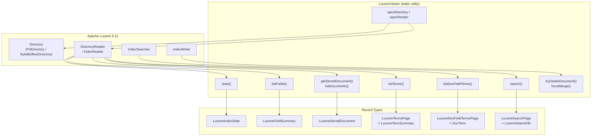
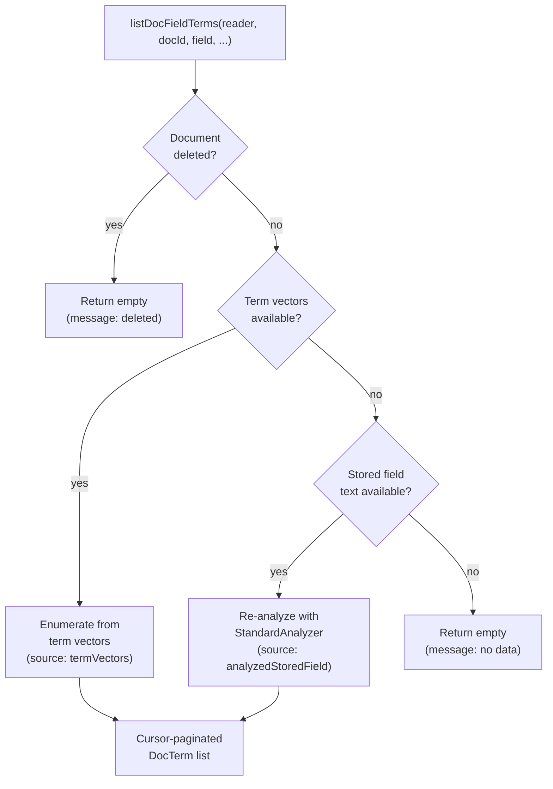
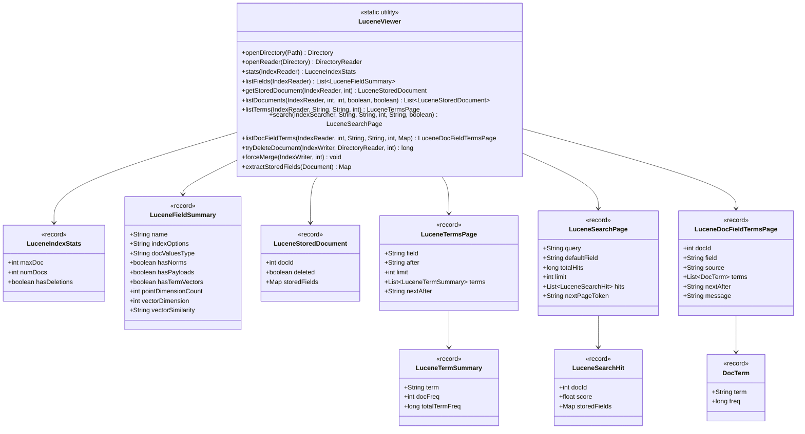
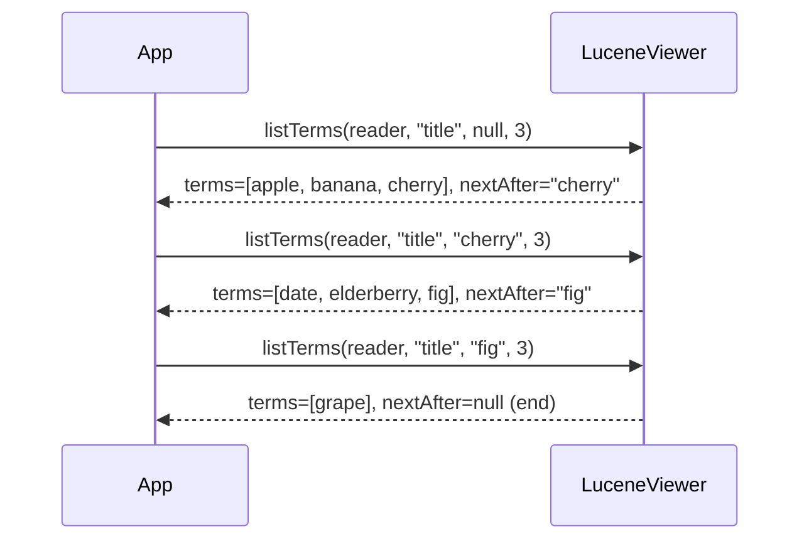
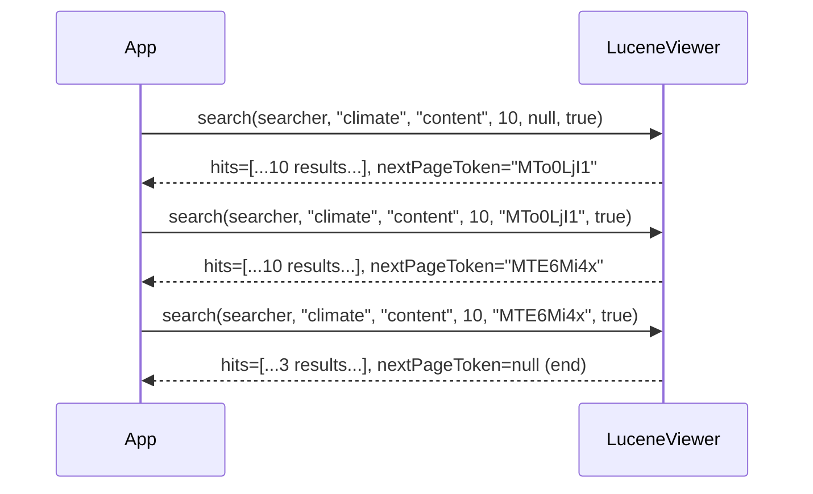

# Hitorro Lucene Viewer

A Luke-like Lucene index inspection library for Java 21+. Provides programmatic access to index statistics, field metadata, stored documents, term enumeration, full-text search, and document-level term analysis -- all with cursor-based pagination for safe use on large indexes.

---

## Table of Contents

- [Features](#features)
- [Prerequisites](#prerequisites)
- [Installation](#installation)
- [Building](#building)
- [Testing](#testing)
- [Architecture](#architecture)
- [Quick Start](#quick-start)
- [API Reference](#api-reference)
  - [Opening an Index](#opening-an-index)
  - [Index Statistics](#index-statistics)
  - [Field Listing](#field-listing)
  - [Document Retrieval](#document-retrieval)
  - [Term Enumeration](#term-enumeration)
  - [Full-Text Search](#full-text-search)
  - [Document Field Terms](#document-field-terms)
  - [Delete and Merge Operations](#delete-and-merge-operations)
- [Data Types](#data-types)
- [Pagination](#pagination)
- [Integration Examples](#integration-examples)
- [Configuration Reference](#configuration-reference)

---

## Features

- **Index Statistics**: Document counts, deletion state, max document ID
- **Field Inspection**: Complete field metadata including index options, doc values, norms, payloads, term vectors, point dimensions, and vector search configuration
- **Document Browsing**: Retrieve individual or paginated stored documents with deletion awareness
- **Term Enumeration**: Cursor-based browsing of terms per field with doc frequency and total term frequency
- **Full-Text Search**: Lucene query syntax with ScoreDoc-based pagination and optional stored field retrieval
- **Document Field Terms**: Per-document term analysis with automatic fallback from term vectors to stored-field analysis
- **Delete & Merge**: Best-effort document deletion and forced segment merging
- **Multi-Value Support**: Fields with multiple values per document are returned as lists
- **Zero Dependencies on HiTorro**: Standalone library depending only on Apache Lucene -- usable with any Lucene index

---

## Prerequisites

| Requirement | Version | Notes |
|-------------|---------|-------|
| **Java** | 21+ | Required |
| **Maven** | 3.8+ | Required for building |

---

## Installation

Add the dependency to your `pom.xml`:

```xml
<dependency>
    <groupId>com.hitorro</groupId>
    <artifactId>hitorro-luceneviewer</artifactId>
    <version>3.0.0</version>
</dependency>
```

---

## Building

```bash
cd hitorro-luceneviewer

# Full build with tests
mvn clean install

# Build without tests
mvn clean install -DskipTests
```

### Build Dependencies

| Library | Version | Purpose |
|---------|---------|---------|
| Apache Lucene core | 9.12.0 | Index reading, stored fields, term enumeration |
| Apache Lucene queryparser | 9.12.0 | Query parsing for search |
| Apache Lucene analysis-common | 9.12.0 | StandardAnalyzer for fallback term analysis |
| JUnit 5 | 5.11.4 | Testing framework |
| AssertJ | 3.27.3 | Fluent test assertions |

No dependencies on other hitorro modules -- this is a standalone Lucene utility library.

---

## Testing

```bash
# Run all tests
mvn test

# Run single test
mvn test -Dtest=LuceneViewerTest
```

Tests use in-memory Lucene indexes (`ByteBuffersDirectory`) for fast, filesystem-free execution.

### Test Coverage

| Test | What It Verifies |
|------|-----------------|
| `canListFieldsAndFetchStoredDoc` | Creates in-memory index with StringField + TextField, verifies `listFields()` returns both, `getStoredDocument()` retrieves stored values, document is not marked deleted, `listTerms()` returns terms from the text field |

---

## Architecture



### Design Principles

- **Static Utility Class**: `LuceneViewer` is a final class with a private constructor. All methods are static -- no instantiation, no state.
- **Record-Based Data Types**: All return types are Java records (immutable, transparent data carriers).
- **Cursor-Based Pagination**: Terms and search results use cursor tokens for safe traversal of large result sets without loading everything into memory.
- **Fallback Strategy**: Document-level term analysis prefers term vectors, falls back to re-analyzing stored field text with `StandardAnalyzer`.
- **Deletion Awareness**: All document operations detect soft-deleted documents via `MultiBits.getLiveDocs()`.

---

## Quick Start

```java
import com.hitorro.luceneviewer.*;
import org.apache.lucene.index.DirectoryReader;
import org.apache.lucene.store.Directory;
import java.nio.file.Path;

// Open an index
Directory dir = LuceneViewer.openDirectory(Path.of("/path/to/index"));
DirectoryReader reader = LuceneViewer.openReader(dir);

// Get statistics
LuceneIndexStats stats = LuceneViewer.stats(reader);
System.out.println("Documents: " + stats.numDocs());
System.out.println("Max doc ID: " + stats.maxDoc());

// List fields
var fields = LuceneViewer.listFields(reader);
for (LuceneFieldSummary f : fields) {
    System.out.println(f.name() + " - " + f.indexOptions());
}

// Browse terms in a field
LuceneTermsPage page = LuceneViewer.listTerms(reader, "title", null, 20);
for (LuceneTermSummary t : page.terms()) {
    System.out.println(t.term() + " (docs: " + t.docFreq() + ")");
}

// Get a stored document
LuceneStoredDocument doc = LuceneViewer.getStoredDocument(reader, 0);
System.out.println("Fields: " + doc.storedFields().keySet());

// Search
IndexSearcher searcher = new IndexSearcher(reader);
LuceneSearchPage results = LuceneViewer.search(searcher, "climate", "content", 10, null, true);
System.out.println("Total hits: " + results.totalHits());
for (LuceneSearchHit hit : results.hits()) {
    System.out.println("Doc " + hit.docId() + " score=" + hit.score());
}

reader.close();
dir.close();
```

---

## API Reference

### Opening an Index

```java
// Open a filesystem directory
Directory dir = LuceneViewer.openDirectory(Path.of("/path/to/index"));

// Open a reader
DirectoryReader reader = LuceneViewer.openReader(dir);
```

### Index Statistics

```java
LuceneIndexStats stats = LuceneViewer.stats(reader);

stats.maxDoc();        // Maximum document ID (includes deleted)
stats.numDocs();       // Number of non-deleted documents
stats.hasDeletions();  // Whether index has soft-deleted documents
```

### Field Listing

```java
List<LuceneFieldSummary> fields = LuceneViewer.listFields(reader);
```

Returns all fields in the index (merged across all segments), sorted by name. Each `LuceneFieldSummary` contains:

| Property | Type | Description |
|----------|------|-------------|
| `name` | String | Field name |
| `indexOptions` | String | DOCS, DOCS_AND_FREQS, DOCS_AND_FREQS_AND_POSITIONS, etc. |
| `docValuesType` | String | NONE, NUMERIC, BINARY, SORTED, SORTED_NUMERIC, SORTED_SET |
| `hasNorms` | boolean | Stores length normalization factors |
| `hasPayloads` | boolean | Has term payloads |
| `hasTermVectors` | boolean | Has per-document term vectors |
| `pointDimensionCount` | int | Point field dimensions (0 if not a point field) |
| `pointIndexDimensionCount` | int | Point index dimensions |
| `pointNumBytes` | int | Bytes per point dimension |
| `vectorDimension` | int | Vector field dimensions (0 if not a vector field) |
| `vectorEncoding` | String | BYTE or FLOAT32 |
| `vectorSimilarity` | String | EUCLIDEAN, DOT_PRODUCT, COSINE |

### Document Retrieval

#### Single Document

```java
LuceneStoredDocument doc = LuceneViewer.getStoredDocument(reader, docId);

doc.docId();         // Lucene internal document ID
doc.deleted();       // true if soft-deleted
doc.storedFields();  // Map<String, List<Object>> -- field name to values
```

Throws `IllegalArgumentException` if `docId` is out of range. Deleted documents return empty stored fields.

#### Paginated Document List

```java
List<LuceneStoredDocument> docs = LuceneViewer.listDocuments(
    reader,
    0,       // docIdStart
    20,      // limit
    true,    // includeStoredFields
    false    // includeDeleted
);
```

| Parameter | Description |
|-----------|-------------|
| `docIdStart` | Starting document ID (clamped to 0) |
| `limit` | Maximum documents to return |
| `includeStoredFields` | Load stored field values (false = metadata only) |
| `includeDeleted` | Include soft-deleted documents |

### Term Enumeration

```java
LuceneTermsPage page = LuceneViewer.listTerms(reader, "title", null, 50);

page.field();       // Field name
page.after();       // Cursor position (null for first page)
page.limit();       // Effective limit (capped 1-5000)
page.terms();       // List<LuceneTermSummary>
page.nextAfter();   // Cursor for next page (null if end reached)
```

Each `LuceneTermSummary`:

| Property | Type | Description |
|----------|------|-------------|
| `term` | String | Term text |
| `docFreq` | int | Number of documents containing this term |
| `totalTermFreq` | long | Total occurrences across all documents |

#### Paginating Through All Terms

```java
String cursor = null;
do {
    LuceneTermsPage page = LuceneViewer.listTerms(reader, "content", cursor, 100);
    for (LuceneTermSummary t : page.terms()) {
        System.out.println(t.term() + " (" + t.docFreq() + " docs)");
    }
    cursor = page.nextAfter();
} while (cursor != null);
```

### Full-Text Search

```java
IndexSearcher searcher = new IndexSearcher(reader);

LuceneSearchPage page = LuceneViewer.search(
    searcher,
    "title:climate AND department:Research",  // Lucene query syntax
    "content",    // default field (fallback if no field specified in query)
    10,           // limit (capped 1-200)
    null,         // pageToken (null for first page)
    true          // includeStoredFields
);

page.query();          // Query string
page.defaultField();   // Default field used
page.totalHits();      // Total matching documents
page.limit();          // Effective limit
page.hits();           // List<LuceneSearchHit>
page.nextPageToken();  // Token for next page (null if done)
```

Each `LuceneSearchHit`:

| Property | Type | Description |
|----------|------|-------------|
| `docId` | int | Lucene document ID |
| `score` | float | Search relevance score |
| `storedFields` | Map | Stored field values (empty if not requested) |

#### Paginating Search Results

```java
String token = null;
do {
    LuceneSearchPage page = LuceneViewer.search(searcher, "climate", "content", 10, token, true);
    for (LuceneSearchHit hit : page.hits()) {
        System.out.println("Doc " + hit.docId() + " score=" + hit.score());
    }
    token = page.nextPageToken();
} while (token != null);
```

### Document Field Terms

Lists terms present in a specific field of a specific document:



```java
// First, get stored fields for fallback
LuceneStoredDocument doc = LuceneViewer.getStoredDocument(reader, 0);

LuceneDocFieldTermsPage page = LuceneViewer.listDocFieldTerms(
    reader,
    0,                      // docId
    "title",                // field
    null,                   // after cursor
    100,                    // limit (capped 1-5000)
    doc.storedFields()      // fallback for analysis if no term vectors
);

page.docId();      // Document ID
page.field();      // Field name
page.source();     // "termVectors" or "analyzedStoredField"
page.terms();      // List<DocTerm> -- each has term() and freq()
page.nextAfter();  // Cursor for next page
page.message();    // Optional info (e.g., fallback reason)
```

### Delete and Merge Operations

```java
IndexWriter writer = ...;
DirectoryReader reader = ...;

// Delete a document (best-effort by Lucene internal doc ID)
long seqNo = LuceneViewer.tryDeleteDocument(writer, reader, docId);
if (LuceneViewer.wasDeleted(seqNo)) {
    System.out.println("Deleted successfully");
}

// Force merge segments
LuceneViewer.forceMerge(writer, 1);  // merge to 1 segment
```

### Stored Field Extraction Utility

```java
// Convert a Lucene Document to a Map
Document luceneDoc = reader.storedFields().document(docId);
Map<String, List<Object>> fields = LuceneViewer.extractStoredFields(luceneDoc);
```

Handles numeric values, binary values (Base64-encoded), string values, and null values. Multi-valued fields produce lists with multiple entries. Fields are sorted by name (TreeMap).

---

## Data Types

All data types are Java records (immutable, with auto-generated `equals`, `hashCode`, `toString`).



---

## Pagination

The module uses two pagination strategies, both cursor-based for safety on large indexes.

### Term Pagination (Cursor String)

Uses the last term text as a cursor. The `after` parameter is exclusive -- the next page starts after this term.



### Search Pagination (Base64 Token)

Uses a Base64URL-encoded `docId:score` token. Internally backed by Lucene's `searchAfter()` for efficient deep pagination.



### Limits

| Method | Min | Max | Default |
|--------|-----|-----|---------|
| `listTerms` | 1 | 5000 | -- |
| `listDocFieldTerms` | 1 | 5000 | -- |
| `search` | 1 | 200 | -- |

---

## Integration Examples

### REST API (Spring Boot)

The `hitorro-jvs-example-springboot` application wraps `LuceneViewer` in a Spring controller (`LuceneViewerController`):

```java
@GetMapping("/api/jvs/viewer/stats")
public ResponseEntity<LuceneIndexStats> getStats() {
    return ResponseEntity.ok(LuceneViewer.stats(reader));
}

@GetMapping("/api/jvs/viewer/fields")
public ResponseEntity<List<LuceneFieldSummary>> getFields() {
    return ResponseEntity.ok(LuceneViewer.listFields(reader));
}

@GetMapping("/api/jvs/viewer/terms/{field}")
public ResponseEntity<LuceneTermsPage> getTerms(
        @PathVariable String field,
        @RequestParam(required = false) String after,
        @RequestParam(defaultValue = "50") int limit) {
    return ResponseEntity.ok(LuceneViewer.listTerms(reader, field, after, limit));
}
```

### With hitorro-index

```java
// Create and populate an index using hitorro-index
IndexConfig config = IndexConfig.filesystem("/path/to/index").build();
JVSLuceneIndexWriter writer = new JVSLuceneIndexWriter(config);
writer.indexDocuments(documents);
writer.commit();
writer.close();

// Inspect with LuceneViewer
Directory dir = LuceneViewer.openDirectory(Path.of("/path/to/index"));
DirectoryReader reader = LuceneViewer.openReader(dir);

LuceneIndexStats stats = LuceneViewer.stats(reader);
System.out.println("Indexed " + stats.numDocs() + " documents");

var fields = LuceneViewer.listFields(reader);
System.out.println("Fields: " + fields.stream().map(LuceneFieldSummary::name).toList());

// Browse terms in a projected field
LuceneTermsPage terms = LuceneViewer.listTerms(reader, "title.mls.text_en_s", null, 20);
for (LuceneTermSummary t : terms.terms()) {
    System.out.println("  " + t.term() + " (in " + t.docFreq() + " docs)");
}
```

### CLI Diagnostic Tool

```java
public static void main(String[] args) throws Exception {
    Path indexPath = Path.of(args[0]);
    Directory dir = LuceneViewer.openDirectory(indexPath);
    DirectoryReader reader = LuceneViewer.openReader(dir);

    // Stats
    var stats = LuceneViewer.stats(reader);
    System.out.printf("Documents: %d (max ID: %d, deletions: %b)%n",
        stats.numDocs(), stats.maxDoc(), stats.hasDeletions());

    // Fields
    System.out.println("\nFields:");
    for (var f : LuceneViewer.listFields(reader)) {
        System.out.printf("  %-40s index=%-40s docValues=%s vectors=%d%n",
            f.name(), f.indexOptions(), f.docValuesType(), f.vectorDimension());
    }

    // Top terms in first field
    var fields = LuceneViewer.listFields(reader);
    if (!fields.isEmpty()) {
        String field = fields.get(0).name();
        System.out.printf("\nTop terms in '%s':%n", field);
        var terms = LuceneViewer.listTerms(reader, field, null, 10);
        for (var t : terms.terms()) {
            System.out.printf("  %-30s docs=%d freq=%d%n", t.term(), t.docFreq(), t.totalTermFreq());
        }
    }

    reader.close();
    dir.close();
}
```

---

## Configuration Reference

This module has no configuration files. All behavior is controlled via method parameters.

### Method Parameter Summary

| Method | Key Parameters |
|--------|---------------|
| `openDirectory` | `Path indexPath` |
| `stats` | `IndexReader reader` |
| `listFields` | `IndexReader reader` |
| `getStoredDocument` | `IndexReader reader`, `int docId` |
| `listDocuments` | `IndexReader reader`, `int docIdStart`, `int limit`, `boolean includeStoredFields`, `boolean includeDeleted` |
| `listTerms` | `IndexReader reader`, `String field`, `String after` (cursor), `int limit` (1-5000) |
| `search` | `IndexSearcher searcher`, `String queryString`, `String defaultField`, `int limit` (1-200), `String pageToken`, `boolean includeStoredFields` |
| `listDocFieldTerms` | `IndexReader reader`, `int docId`, `String field`, `String after`, `int limit` (1-5000), `Map storedFieldsFallback` |
| `tryDeleteDocument` | `IndexWriter writer`, `DirectoryReader reader`, `int docId` |
| `forceMerge` | `IndexWriter writer`, `int maxSegments` |

---

## License

MIT License -- Copyright (c) 2006-2025 Chris Collins
